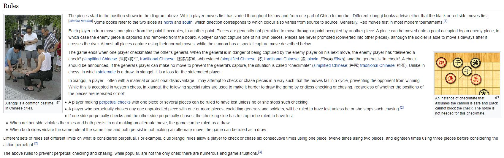
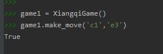

# Xiangqi Game (Chinese Chess)   

## Contents  
I have provided on python file for this command-line game of Xiangqi.  

## Overview  
I have created a command-line version of the Xiangqi Game.  

**Rules** (from : [Wikipedia](https://en.wikipedia.org/wiki/Xiangqi))  

  

## Game Description  

A very popular board game in China, similar to chess.  

Example Xiangqi Board:  
  

## Game Instructions   

1. Initialize the game using: game_name = XiangqiGame()  
2. Make moves using the function: game_name.makemove('c1','e3'), letters go horizontally from a-i and numbers go vertically from 1 (top) to 10 (bottom).  
3. Red goes first.  
4. Play the game!  

Example:  
  